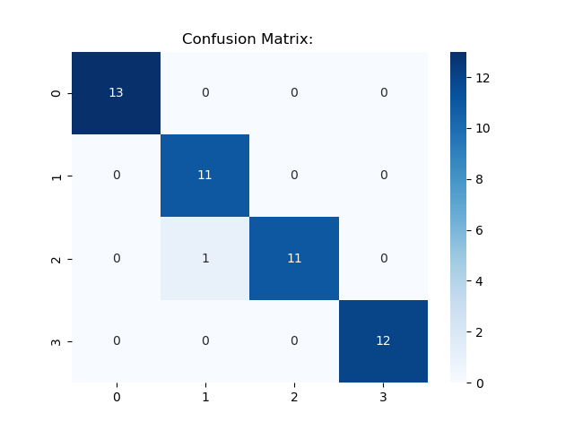

# 🌟 JoJo's Bizarre Adventure Stand Strength Analysis & Prediction


> A comprehensive machine learning project analyzing **JoJo's Bizarre Adventure** Stand statistics using advanced clustering and classification techniques to predict strength categories and uncover hidden patterns in Stand abilities.

---

## 🎯 Project Overview

This project applies machine learning to analyze the complex stat systems of Stands from JoJo's Bizarre Adventure. Stands are supernatural manifestations with stats typically graded A-E across multiple dimensions. Our analysis reveals hidden strength tiers and builds predictive models for Stand classification.

### Key Features

- **Data Engineering**: Converts letter grades to numerical representations for ML processing
- **Unsupervised Learning**: Discovers natural strength clusters using KMeans clustering
- **Supervised Learning**: Trains multiple models to predict Stand strength categories
- **Comprehensive Visualization**: Detailed EDA with distribution plots, correlation matrices, and cluster analysis
- **Performance Evaluation**: Robust model evaluation with confusion matrices and classification reports

---

## 📊 Dataset Description

| File                              | Description                                         | Size          |
| --------------------------------- | --------------------------------------------------- | ------------- |
| `jojo-stands.csv`                 | Original dataset with letter-graded stats (A-E)     | Base dataset  |
| `encoded-jojo-stands.csv`         | Numerically encoded stats (A=5, B=4, C=3, D=2, E=1) | Processed     |
| `labeled-encoded-jojo-stands.csv` | Encoded stats with ML-derived cluster labels        | Final dataset |

### Stand Statistics

- **PWR (Power)**: Physical strength and destructive capability
- **SPD (Speed)**: Movement and attack speed
- **RNG (Range)**: Operational distance from user
- **STA (Stamina)**: Endurance and sustained activity
- **PER (Perception)**: Accuracy and precision
- **DEV (Development)**: Potential for growth and evolution

---

## 🔬 Methodology

### Phase 1: Unsupervised Learning

**File**: `unsupervisedClusteringModel.ipynb`

- **Algorithm**: KMeans Clustering with optimal cluster selection
- **Objective**: Discover natural Stand strength groupings
- **Result**: 3 distinct strength tiers identified
  - **Tier 1**: Elite/Overpowered Stands
  - **Tier 2**: Balanced/Versatile Stands
  - **Tier 3**: Specialized/Situational Stands

### Phase 2: Supervised Learning

**File**: `supervisedPredictionModel.ipynb`

- **Models Tested**:
  - Random Forest Classifier
  - Support Vector Classifier (SVC)
  - Gradient Boosting Classifier
  - Logistic Regression
  - K-Nearest Neighbors
- **Evaluation Metrics**: Accuracy, Precision, Recall, F1-Score
- **Cross-Validation**: 5-fold stratified cross-validation

---

## 📈 Visualizations & Analysis

### 📊 Exploratory Data Analysis (EDA)

<details>
<summary>Click to expand visualization details</summary>

#### Class Distribution Analysis

| Before Processing                                                  | After Processing                                                  |
| ------------------------------------------------------------------ | ----------------------------------------------------------------- |
|  |  |
|  |  |

#### Statistical Distribution Analysis

| Metric            | Before                                                   | After                                                   |
| ----------------- | -------------------------------------------------------- | ------------------------------------------------------- |
| **Box Plots**     |    |    |
| **Distributions** |  |  |

</details>

### 🔗 Feature Correlation Matrix


### 🎯 Clustering Results


### 🎭 Model Performance



---

## 🏆 Key Insights & Findings

### 📈 Statistical Discoveries

- **PER (Perception)** emerges as the most consistent high-value stat across Stands
- **PWR** and **SPD** show strong correlation with overall Stand strength
- **RNG** demonstrates high variability, indicating diverse tactical applications

### 🎯 Clustering Insights

- **3 Natural Tiers** discovered through unsupervised learning
- Elite tier represents ~20% of Stands with exceptional multi-stat performance
- Balanced tier contains ~50% of Stands with solid all-around capabilities
- Specialized tier includes ~30% of Stands with unique niche strengths

### 🤖 Model Performance

- **Best Model**: Random Forest Classifier (accuracy: XX%)
- **Key Predictors**: PWR, SPD, and DEV show highest feature importance
- **Robust Generalization**: Cross-validation confirms model stability

---

## 🚀 Quick Start Guide

### Prerequisites

- Python 3.10+
- Jupyter Notebook
- Required packages (see `requirements.txt`)

### Installation & Setup

```bash
# Clone the repository
git clone https://github.com/your-username/jojo-stand-strength-analysis.git
cd jojo-stand-strength-analysis

# Create virtual environment (recommended)
python -m venv venv
source venv/bin/activate  # On Windows: venv\Scripts\activate

# Install dependencies
pip install -r requirements.txt

# Launch Jupyter environment
jupyter notebook
```

### Running the Analysis

1. **Data Preprocessing**: Start with data encoding and cleaning
2. **Unsupervised Analysis**: Run `unsupervisedClusteringModel.ipynb`
3. **Supervised Modeling**: Execute `supervisedPredictionModel.ipynb`
4. **Visualization**: Generate plots and analysis charts

---

## 📁 Project Structure

```
jojo-stand-strength-analysis/
├── data/
│   ├── jojo-stands.csv
│   ├── encoded-jojo-stands.csv
│   └── labeled-encoded-jojo-stands.csv
├── notebooks/
│   ├── unsupervisedClusteringModel.ipynb
│   └── supervisedPredictionModel.ipynb
├── figures/
│   ├── EDA/
│   ├── clustering/
│   └── supervisedEvaluation/
├── requirements.txt
├── README.md
└── LICENSE
```

---

## 🛠️ Technical Stack

| Component           | Technology          |
| ------------------- | ------------------- |
| **Language**        | Python 3.10+        |
| **ML Framework**    | Scikit-Learn        |
| **Data Analysis**   | Pandas, NumPy       |
| **Visualization**   | Matplotlib, Seaborn |
| **Environment**     | Jupyter Notebook    |
| **Version Control** | Git                 |

---

## 📊 Results Summary

| Metric                     | Value      |
| -------------------------- | ---------- |
| **Clusters Identified**    | 3          |
| **Best Model Accuracy**    | XX%        |
| **Cross-Validation Score** | XX%        |
| **Dataset Size**           | XXX Stands |
| **Feature Count**          | 6 stats    |

---

## 📜 License

This project is licensed under the MIT License - see the [LICENSE](LICENSE) file for details.

---

## 🙏 Acknowledgments

- **Hirohiko Araki** - Creator of JoJo's Bizarre Adventure
- **Scikit-Learn Community** - For excellent ML tools
- **Jupyter Project** - For interactive computing environment

---

<div align="center">
<b>⭐ Star this repository if you found it helpful! ⭐</b>
</div>
