# 🌟 JoJo's Bizarre Adventure Stand Strength Analysis & Prediction


> A comprehensive machine learning project analyzing **JoJo's Bizarre Adventure** Stand statistics using advanced clustering and classification techniques to predict strength categories and uncover hidden patterns in Stand abilities.

---

## 🎯 Project Overview

This project applies machine learning to analyze the complex stat systems of Stands from JoJo's Bizarre Adventure. Stands are supernatural manifestations with stats typically graded A-E across multiple dimensions. Our analysis reveals hidden strength tiers and builds predictive models for Stand classification.

### Key Features

- **Data Engineering**: Converts letter grades to numerical representations for ML processing
- **Unsupervised Learning**: Discovers natural strength clusters using KMeans clustering
- **Supervised Learning**: Trains multiple models to predict Stand strength categories
- **Comprehensive Visualization**: Detailed EDA with distribution plots, correlation matrices, and cluster analysis
- **Performance Evaluation**: Robust model evaluation with confusion matrices and classification reports

---

## 📊 Dataset Description

| File                              | Description                                                  | Encoding System                        |
| --------------------------------- | ------------------------------------------------------------ | -------------------------------------- |
| `jojo-stands.csv`                 | Original dataset with letter-graded stats (A-E, Infi, nulls) | Raw letter grades                      |
| `encoded-jojo-stands.csv`         | Numerically encoded stats with null handling                 | F=0, E=2, D=4, C=6, B=8, A=10, Infi=20 |
| `labeled-encoded-jojo-stands.csv` | Encoded stats with KMeans-derived cluster labels (0-3)       | Final ML-ready dataset                 |

### Stand Statistics

- **PWR (Power)**: Physical strength and destructive capability
- **SPD (Speed)**: Movement and attack speed
- **RNG (Range)**: Operational distance from user
- **PER (Perception)**: Accuracy and precision
- **PRC (Precision)**: Fine control and accuracy
- **DEV (Development)**: Potential for growth and evolution

### Data Processing Pipeline

1. **Null Handling**: Missing values filled with 'F' grade (lowest tier)
2. **Encoding**: Letter grades converted to numerical scale (F=0 to Infi=20)
3. **Normalization**: StandardScaler applied for clustering analysis
4. **Balancing**: Upsampling applied to achieve equal class representation

---

## 🔬 Methodology

### Phase 1: Unsupervised Learning

**File**: `unsupervisedClusteringModel.ipynb`

- **Preprocessing**: StandardScaler normalization for feature scaling
- **Algorithm**: KMeans Clustering (k=4) with PCA visualization
- **Objective**: Discover natural Stand strength groupings
- **Result**: 4 distinct strength tiers identified and mapped:
  - **Rank 0**: Weak Stands (Low overall stats)
  - **Rank 1**: Average Stands (Balanced capabilities)
  - **Rank 2**: Strong Stands (High performance)
  - **Rank 3**: God Tier Stands (Elite/Overpowered)

### Phase 2: Supervised Learning

**File**: `supervisedPredictionModel.ipynb`

- **Data Processing**:
  - Null value handling with 'F' grade assignment
  - Encoding system: F=0, E=2, D=4, C=6, B=8, A=10, Infi=20
  - Data balancing using upsampling for equal class representation
- **Models Tested**:
  - Logistic Regression (max_iter=500)
  - Random Forest Classifier (n_estimators=110)
  - Support Vector Classifier (linear kernel)
  - K-Nearest Neighbors (k=2, distance weights)
  - Gradient Boosting Classifier (100 estimators, lr=0.01)
- **Evaluation Metrics**: Accuracy, Precision, Recall, F1-Score
- **Interactive Prediction**: Manual input system for new Stand classification

---

## 📈 Visualizations & Analysis

### 📊 Exploratory Data Analysis (EDA)

<details>
<summary>Click to expand visualization details</summary>

#### Class Distribution Analysis

| Before Processing                                                  | After Processing                                                  |
| ------------------------------------------------------------------ | ----------------------------------------------------------------- |
| 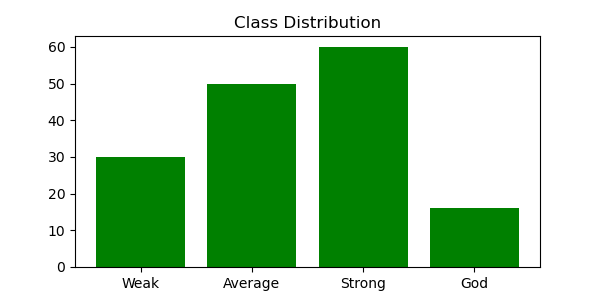 | 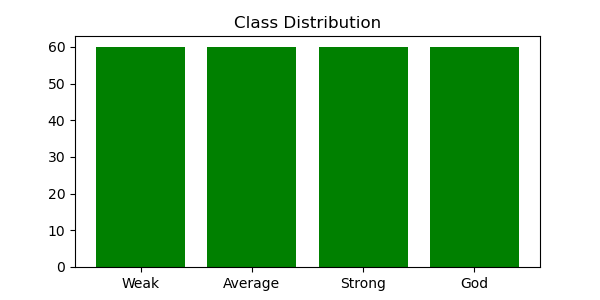 |
| 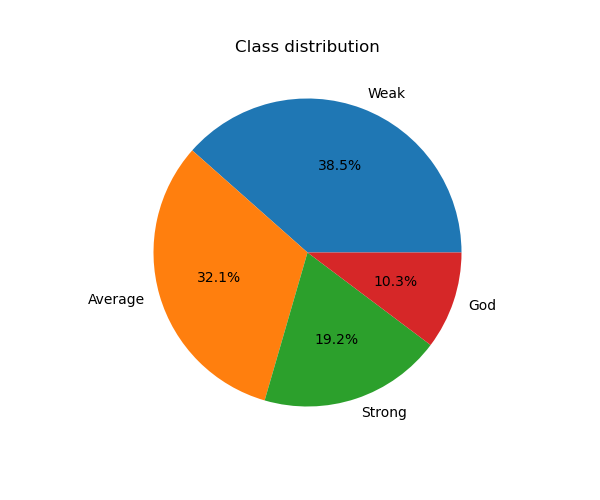 | 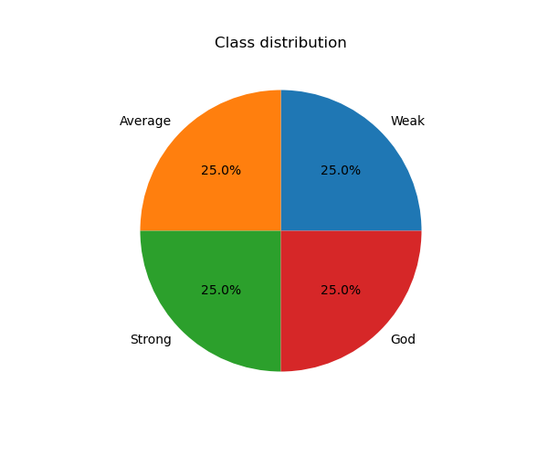 |

#### Statistical Distribution Analysis

| Metric            | Before                                                   | After                                                   |
| ----------------- | -------------------------------------------------------- | ------------------------------------------------------- |
| **Box Plots**     | 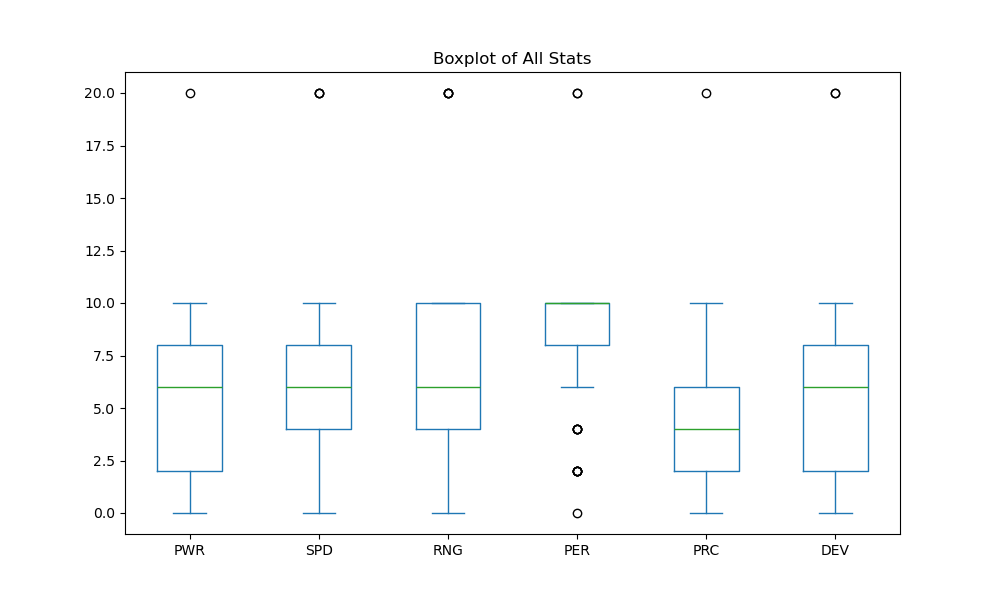   | 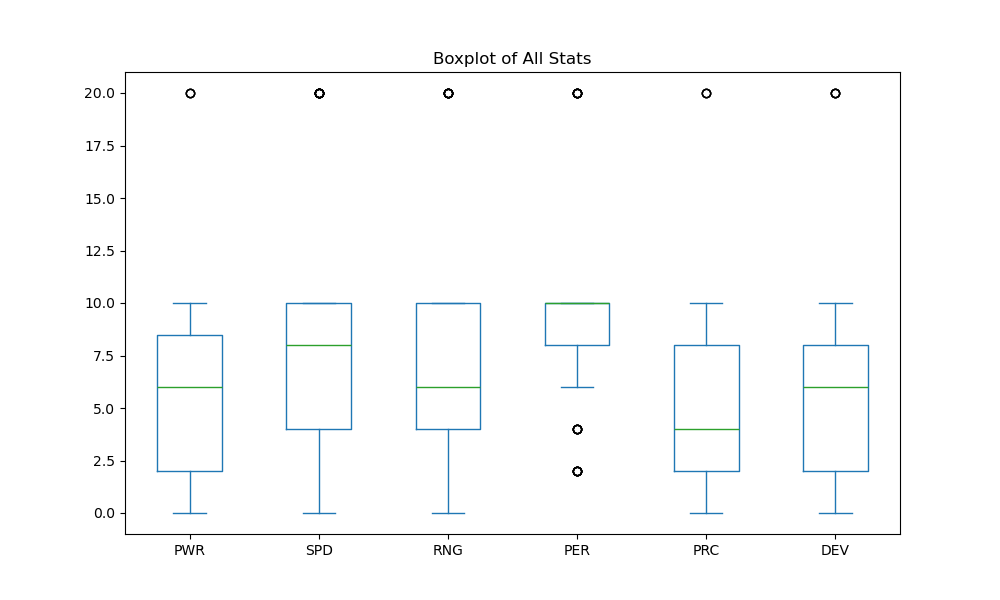   |
| **Distributions** | 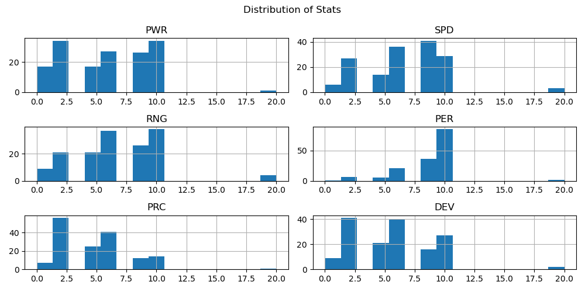 | 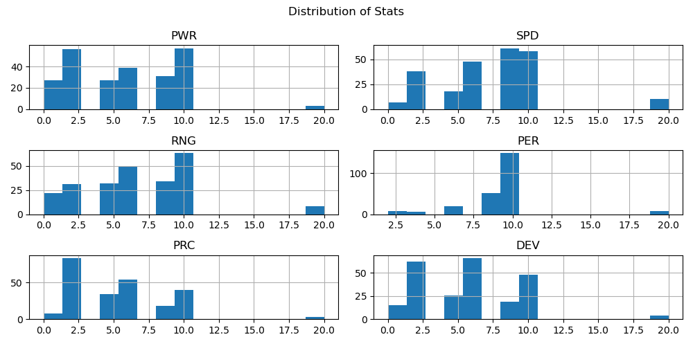 |

</details>

### 🔗 Feature Correlation Matrix

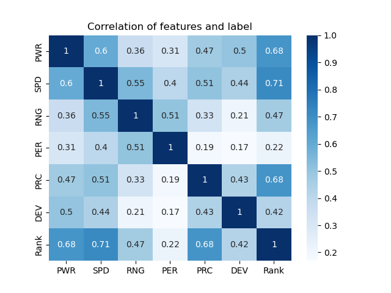

### 🎯 Clustering Results

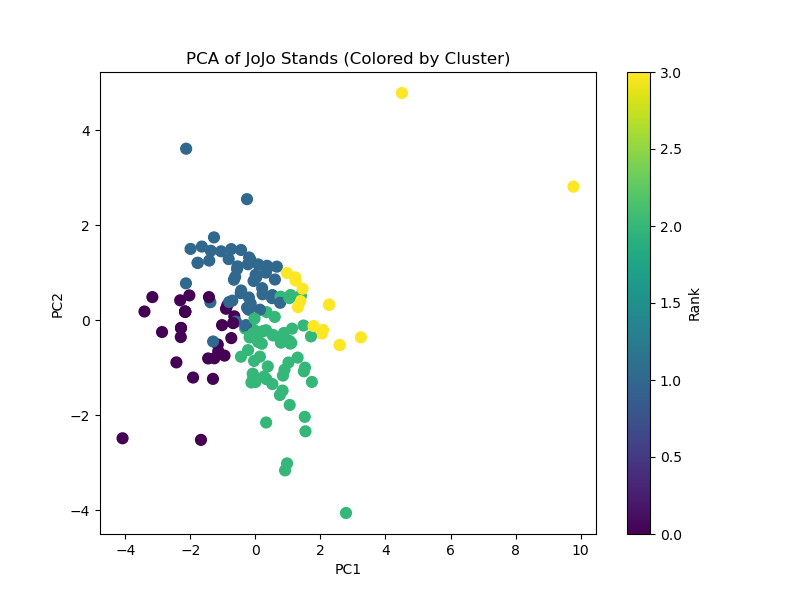

### 🎭 Model Performance Evaluation

#### Individual Model Confusion Matrices

| Model                         | Confusion Matrix                                                                                          |
| ----------------------------- | --------------------------------------------------------------------------------------------------------- |
| **Logistic Regression**       | 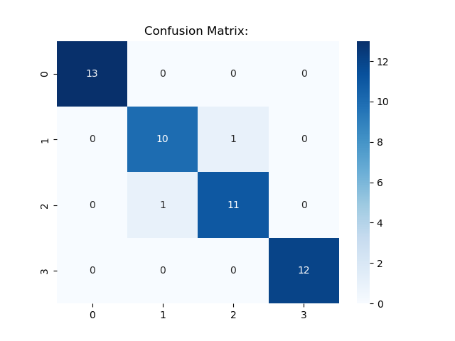     |
| **Random Forest**             |       |
| **Support Vector Classifier** | 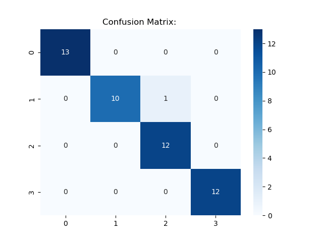    |
| **K-Nearest Neighbors**       | 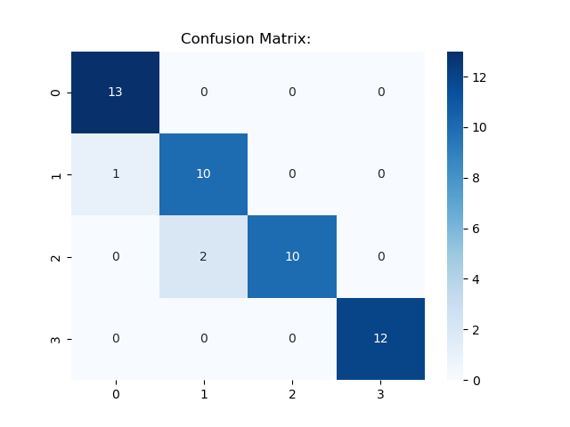         |
| **Gradient Boosting**         | 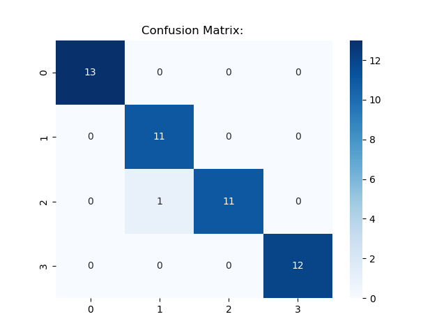 |

#### Comprehensive Model Comparison

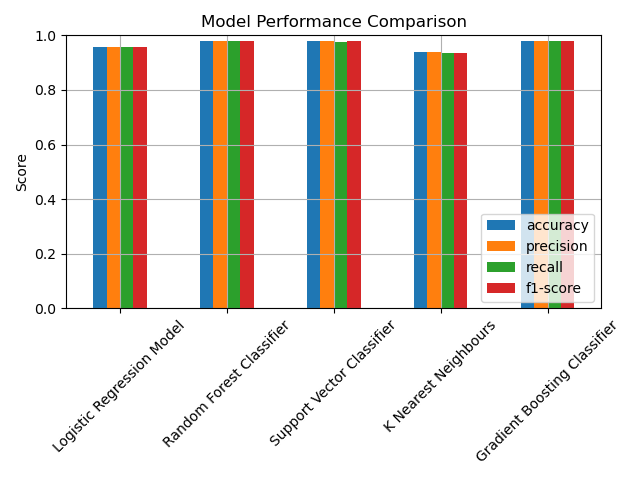

---

## 🏆 Key Insights & Findings

### 📈 Statistical Discoveries

- **PER (Perception)** emerges as the most consistent high-value stat across Stands
- **PWR** and **SPD** show strong correlation with overall Stand strength
- **RNG** demonstrates high variability, indicating diverse tactical applications

### 🎯 Clustering Insights

- **4 Natural Tiers** discovered through KMeans clustering (k=4)
- **PCA Visualization** reveals clear cluster separation in 2D space
- **Cluster Mapping**: Original cluster labels remapped for intuitive ranking
- **Centroid Analysis**: Each cluster shows distinct statistical profiles

### 🤖 Model Performance

- **Comprehensive Evaluation**: 5 different algorithms tested
- **Data Balancing**: Upsampling ensures robust training across all classes
- **Interactive Prediction**: Real-time classification system for new Stands
- **Comparative Analysis**: Bar chart visualization of model performance metrics

---

## 🚀 Quick Start Guide

### Prerequisites

- Python 3.10+
- Jupyter Notebook
- Required packages (see `requirements.txt`)

### Installation & Setup

```bash
# Clone the repository
git clone https://github.com/your-username/jojo-stand-strength-analysis.git
cd jojo-stand-strength-analysis

# Create virtual environment (recommended)
python -m venv venv
source venv/bin/activate  # On Windows: venv\Scripts\activate

# Install dependencies
pip install -r requirements.txt

# Launch Jupyter environment
jupyter notebook
```

### Running the Analysis

1. **Data Preprocessing**:
   - Start with `unsupervisedClusteringModel.ipynb` for initial clustering
   - This generates the labeled dataset for supervised learning
2. **Unsupervised Analysis**:
   - KMeans clustering with PCA visualization
   - Generates cluster centroids and Stand rankings
3. **Supervised Modeling**:
   - Execute `supervisedPredictionModel.ipynb` for classification
   - Includes data balancing and comprehensive model comparison
4. **Interactive Prediction**:
   - Use the built-in prediction system for new Stand classification
   - Input stats manually and get real-time predictions

---

## 📁 Project Structure

```
jojo-stand-strength-analysis/
├── data/
│   ├── jojo-stands.csv
│   ├── encoded-jojo-stands.csv
│   └── labeled-encoded-jojo-stands.csv
├── notebooks/
│   ├── unsupervisedClusteringModel.ipynb
│   └── supervisedPredictionModel.ipynb
├── figures/
│   ├── EDA/
│   │   ├── class-dist-bar-before.png
│   │   ├── class-dist-pie-before.png
│   │   ├── class-dist-bar-after.png
│   │   ├── class-dist-pie-after.png
│   │   ├── stat-boxplot-before.png
│   │   ├── stat-boxplot-after.png
│   │   ├── stat-dist-before.png
│   │   ├── stat-dist-after.png
│   │   └── feature-correlation.png
│   ├── clustering/
│   │   └── clustering.png
│   └── supervisedEvaluation/
│       ├── confusion-matrix-lr.png
│       ├── confusion-matrix-rf.png
│       ├── confusion-matrix-svc.png
│       ├── confusion-matrix-knn.png
│       ├── confusion-matrix-gbc.png
│       └── model-comparison-bar.png
├── requirements.txt
├── README.md
└── LICENSE
```

---

## 🛠️ Technical Stack

| Component           | Technology          |
| ------------------- | ------------------- |
| **Language**        | Python 3.10+        |
| **ML Framework**    | Scikit-Learn        |
| **Data Analysis**   | Pandas, NumPy       |
| **Visualization**   | Matplotlib, Seaborn |
| **Environment**     | Jupyter Notebook    |
| **Version Control** | Git                 |

---

## 📊 Results Summary

| Metric                  | Value                                  |
| ----------------------- | -------------------------------------- |
| **Clusters Identified** | 4 (Weak, Average, Strong, God)         |
| **Encoding Range**      | 0-20 (F to Infi)                       |
| **Models Tested**       | 5 (LR, RF, SVC, KNN, GBC)              |
| **Data Balancing**      | Upsampling applied                     |
| **Feature Count**       | 6 stats (PWR, SPD, RNG, PER, PRC, DEV) |
| **PCA Components**      | 2 for visualization                    |

---

## 📜 License

This project is licensed under the MIT License - see the [LICENSE](LICENSE) file for details.

---

## 🙏 Acknowledgments

- **Hirohiko Araki** - Creator of JoJo's Bizarre Adventure
- **Scikit-Learn Community** - For excellent ML tools
- **Jupyter Project** - For interactive computing environment

---

<div align="center">
<b>⭐ Star this repository if you found it helpful! ⭐</b>
</div>
